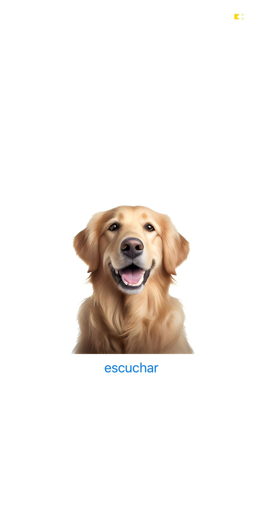

## COMO UTILIZAR LA APLICACION

# Vista previa


Clona o descarga el proyecto

```
git clone https://github.com/angelcruz07/practice_dog.git

```
Instala las dependencias

```
npm install

```
Corre la aplicacion

```
npm start
```

Escanea el codigo QR con la app de Expo GO en tu dispositivo movil o emulador

